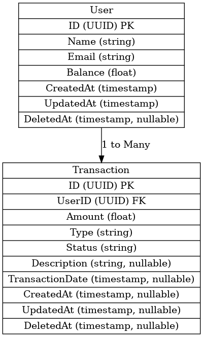

# 💰 Wallet API

A simple wallet management API built using **Go (Gin framework)** and **PostgreSQL**, providing basic functionality for withdrawing funds from a user’s account.  
The project includes **database migrations with seed data**, making it easy to start testing right after setup.

---

## 📋 Table of Contents
1. [Assumptions](#assumptions)
2. [User Story (Process Flow)](#user-story)
3. [Tech Stack](#tech-stack)
4. [Prerequisites](#prerequisites)
5. [Database Architecture](#database-architecture)
6. [Setup & Run](#setup--run)
7. [API Contract](#api-contract)
8. [Limitations & Future Improvements](#limitations--future-improvements)

---

## 📌 Assumptions

- Users already exist in the system (seeded during migration).
- Withdrawals are only allowed if the user has sufficient balance.
- Transactions are immediately marked as completed for simplicity.
- No user registration/login flow is implemented for now — focus is on withdrawal logic.

---

## 🧑‍💻 User Story (Process Flow)

1. 📄 **View Wallet Balance**  
   - The user opens their **Wallet page** in the application.  
   - The frontend calls the API: `GET /api/v1/users/:id` to retrieve the latest balance.  
   - The user sees their current balance on screen.  

2. 🔄 **Refresh Balance**  
   - If the user refreshes the page,  
   - The same API is called again to ensure the balance shown is always up-to-date.  

3. 💵 **Initiate Withdrawal**  
   - The user clicks the **Withdraw** button and enters the desired amount.  
   - The frontend sends a request to:  
     `POST /api/v1/transactions/withdraw` with the `user_id` and `amount`.  

4. ✅ **Successful Withdrawal**  
   - The page is redirected or refreshed, triggering `GET /api/v1/users/:id` again.  
   - The updated balance is displayed, showing the deduction from the withdrawal.  

5. ⚠️ **Insufficient Balance**  
   - If the withdrawal fails due to insufficient balance,  
   - The API responds with an error, and the frontend shows a relevant error message without changing the balance display.

---

## 🛠 Tech Stack

- **Go** v1.24.6
- **Gin** (HTTP framework)
- **PostgreSQL** v16
- **golang-migrate** (database migrations)
- **sqlc** (SQL code generation)
- **DBeaver** (GUI tool for PostgreSQL)
- **Docker** (optional, for running PostgreSQL)
- **Postman** (API testing)
- **VS Code** (editor)

---

## 📦 Prerequisites

Before running the application, ensure you have:

- [Go](https://go.dev/) >= 1.24.6
- [PostgreSQL](https://www.postgresql.org/) >= v16  
  (Can run locally or via Docker)
- [golang-migrate CLI](https://github.com/golang-migrate/migrate)
- [sqlc CLI](https://sqlc.dev/)
- [DBeaver](https://dbeaver.io/) (for database management)
- Git
- (Optional) Docker & Docker Compose

---

## 🗄 Database Architecture Diagram

The following Entity-Relationship Diagram (ERD) illustrates the database structure for the Wallet API:


---

## 🚀 Setup & Run

1. **Clone the repository**
   ```bash
   git clone https://github.com/vincentweilasto16/wallet-api.git
   ```

2. **Install dependencies**
   ```bash
   go mod tidy
   go mod vendor
   ```
   
3. Setup environment
   ```bash
   cp .env.example .env
   ```
   Adjust *.env* to match your local PostgreSQL or Docker Setup

4. Create the database
   ```bash
   CREATE DATABASE wallet_db;
   ```

5. Run the application
   ```bash
   go run cmd/main.go
   ```

6. Test the API with Postman

---

## 📜 API Contract

1. **Get User By ID**
   Endpoint:
   ```bash
   GET /api/v1/users/:id
   ```

   Response (Success - 200 OK):
   ```bash
   {
    "data": {
        "id": "67e1e382-7122-4e77-b47f-f4e940cbf385",
        "name": "Andi Wijaya",
        "email": "andi.wijaya@example.com",
        "balance": 1500000,
        "created_at": "2025-08-15T17:17:21.515714+07:00",
        "updated_at": "2025-08-15T17:17:21.515714+07:00",
        "deleted_at": null
    },
    "meta": {
        "status": 200,
        "message": "ok"
    }
   }
   ```

   Response (Failure - User Not Found - 404 Not Found):
   ```bash
    {
        "data": null,
        "errors": [
            {
                "code": "NOT_FOUND",
                "message": "user not found"
            }
        ],
        "meta": {
            "status": 404,
            "message": "user not found"
        }
    }
   ```

2. **Withdraw**
   Endpoint:
   ```bash
   POST /api/v1/transactions/withdraw
   ```

   Request Body:
   ```bash
   {
    "user_id": "a440fd30-6894-4e93-b041-2f577c09d002",
    "amount": 20000
   }
   ```

   Response (Success - 200 OK):
   ```bash
   {
        "data": {
            "message": "Withdrawal successful"
        },
        "meta": {
            "status": 200,
            "message": "OK"
        }
   }
   ```

   Response (Failure - Insufficient Balance - 422 Unprocessable entity):
   ```bash
    {
        "data": null,
        "errors": [
            {
                "code": "UNPROCESSABLE_ENTITY",
                "message": "insuficient balance"
            }
        ],
        "meta": {
            "status": 422,
            "message": "insuficient balance"
        }
    }
   ```

   Response (Failure - User Not Found - 404 Not Found):
   ```bash
    {
        "data": null,
        "errors": [
            {
                "code": "NOT_FOUND",
                "message": "user not found"
            }
        ],
        "meta": {
            "status": 404,
            "message": "user not found"
        }
    }
   ```

   

---

## 🔮 Limitations & Future Improvements

- **Authentication & Authorization**
  - Implement JWT with Bearer tokens for all API endpoints.

- **Withdraw Transaction Handling**
  - Add rollback mechanism for failed withdrawals.
  - Implement idempotency to prevent duplicate withdrawals.
  - Add rate limiting for withdrawals.

- **Environments**
  - Separate configuration for development, staging, and production.

- **Testing & CI/CD*
  - Unit tests for controller and service layers.
  - GitHub Actions workflow for build & test.

- **Deployment**
  - Dockerfile for containerization.
  - Kubernetes manifests for deployment.

- **Monitoring**
  - Currently only basic logging; can be improved with Prometheus & Grafana.
 
- **Error Handling**
  - Could be enhanced with better structured error responses.

- **Feature Enhancements**
  - Expand transaction status (pending, refund, canceled, failed).
  - Integrate third-party payment gateways.
  - Prevent withdrawals when balance is zero (backend & frontend validation).

---

## 📦 Note

When the application runs migrations, it automatically:
1. Creates required tables.
2. Inserts seed data into the user table.
   
This means you can call the withdraw API immediately with a seeded user_id.

---


